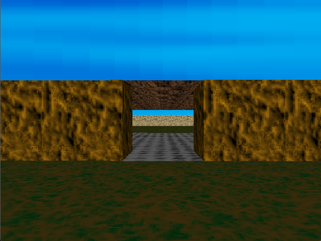

# go-raycasting

A small Wolf3D-style raycaster in Go, plus a built-in level editor.



## What is in here

- Playable game (SDL2)
- Visual level editor (raylib)
- Packaged level format (`.level`) with metadata + embedded assets

## Run

Game:

```sh
go run .
```

Editor:

```sh
go run ./cmd/leveleditor
```

## Default controls

- Move: W / A / S / D
- Menu: Arrow keys + Enter
- Back to menu: Esc

Keybinds and resolution can be changed in the in-game Options screen.

## Editor basics

- Paint walls, floors, and ceilings
- Add / replace / remove texture slots
- Create, open, save, delete level packages
- Edit level metadata (name, author, description, version)

The editor always reads asset files from the root [assets](assets) folder.

## Level files

Levels are stored as `.level` files under [levels](levels). Each package includes:

- Metadata
- Tile maps
- Assets (embedded in the package)
